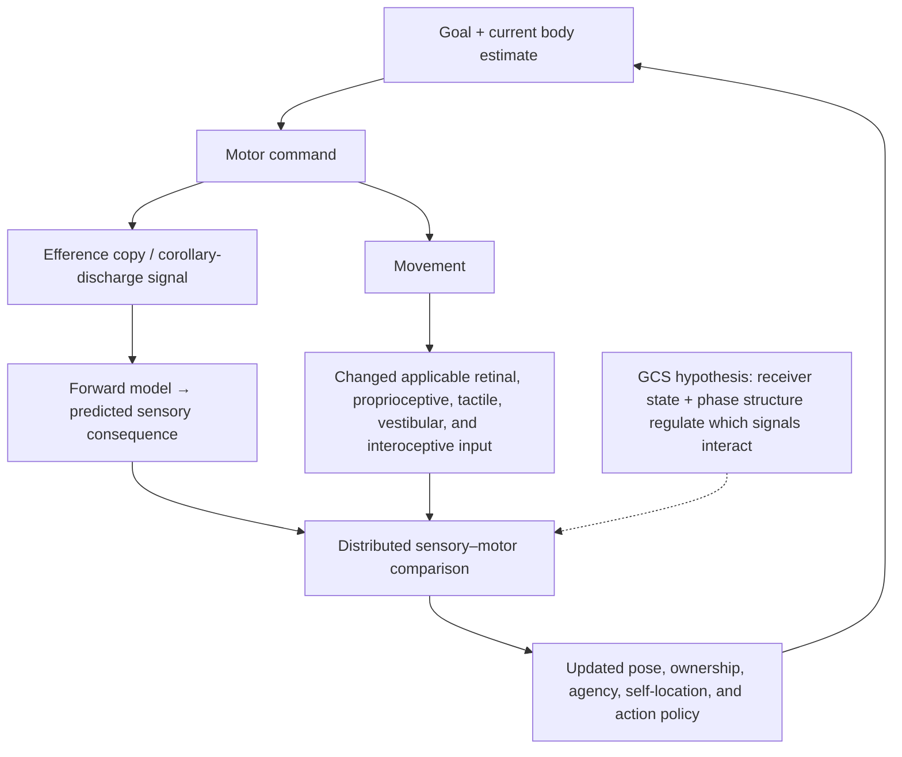

# Embodiment and Vision — Dendritic Rendering and the Gamma Consideration Sandwich


> [!abstract] Bounded synthesis
> SAN proposes that visual, motor, proprioceptive, tactile, vestibular, and interoceptive feedback
> continually update a distributed body-related state. A dendritic arbor can be modeled as a spatial
> receive–transform–re-express field whose overlapping local basis functions form a Gaussian radial-
> basis field (“splats” as visualization shorthand). The Gamma Consideration Sandwich (GCS) is the hypothesis that phase-structured laminar
> activity regulates this update. None of these statements is yet an empirical SAN result.

This note preserves Micah Blumberg's July 2026 clarification and connects it to the dated SAN
genealogy, established neuroscience components, discriminating alternatives, and falsifiable tests.
It is governed by [[san-paper-v2-revision-brief]] and does not authorize publication of SAN v2.

## The idea in one paragraph

When a person sees, moves, imagines moving, or—on SAN's untested extension—imagines feeling a body part, a distributed pattern
across visual, somatosensory, parietal, premotor/motor, cerebellar, insular, thalamic, and other
systems may change. Somatotopic maps can constrain which body part and position are represented, but
they are not the whole self. At the cellular scale, synaptic sites across declared apical and basal
arbor domains, subdivided into branch-local/electrotonic cable compartments, receive a spatial and temporal input pattern. Local dendritic nonlinearities transform
that pattern; somatic spike/burst timing and axonal release re-express it to downstream dendritic
fields. GCS proposes a phase-dependent rule for when predicted motor consequences and incoming
body/world evidence become mutually effective.

> [!warning] Two homunculi must not be confused
> The **cortical homunculus** is a schematic description of somatotopic organization. A
> **homuncular observer** is an imagined little person watching an internal screen. SAN can use the
> first as one source of spatial constraints while rejecting the second. Gordon et al. show that the
> textbook continuous **motor** homunculus in M1 is incomplete; their SCAN integration account is the
> authors' interpretation and does not by itself revise the primary somatosensory map.

## The feedback loop



This is not one feedforward picture. It is a repeatedly closed visual–motor–reafferent loop. A
decoder that recognizes a hand without showing the action–feedback update establishes content, not
the full GCS mechanism.

> [!note] Pathway boundary for the figure
> Arrows in this page and its figures denote routed systems-level influence, not necessarily a
> direct or monosynaptic projection. For example, motor-command information reaches cerebellar
> circuits through cortico-ponto-cerebellar and other relayed routes, and feedback to visual cortex
> can pass through multiple cortical and thalamic stages. The diagram compresses those routes
> without replacing their anatomy.

## Neural array versus dendritic input array

- A **neural array** is a population of neurons or neural subpopulations.
- An **apical arbor** and **basal arbors** are branch systems of one neuron, not single cable-model
  compartments.
- A **dendritic input array** is the spatially arranged set of synaptic sites inside a declared,
  non-overlapping arbor input domain, subdivided into branch-local/electrotonic compartments.
- Soma, axon initial segment, and perisomatic inhibition are modeled separately rather than renamed
  dendritic compartments.
- The dendritic arbor receives and transforms; the axon and its presynaptic terminals principally
  re-express the neuron's output to downstream cells.

The distinction preserves Micah's mechanism without turning one dendrite into a population of
neurons or reversing the known receive/output anatomy.

## Gaussian radial-basis dendritic field


For synaptic site $k$ in arbor domain $c$ of neuron $i$, let $\mu_{ik}$ be the arbor location,
$\Sigma_{ik}$ be a symmetric-positive-definite spread/anisotropy matrix in a declared local coordinate chart, and $\alpha_{ik}(t)$ a signed coefficient that includes
drive, efficacy, local state, and timing. A candidate engineering representation is:

$$
d_i^c(r,t)=
\sum_{k\in S_{i,E}^c\cup S_{i,I}^c}
\alpha_{ik}(t)
\exp\!\left[
-\frac{1}{2}(r-\mu_{ik})^\top
\Sigma_{ik}^{-1}(r-\mu_{ik})
\right].
$$

Positive and negative coefficients encode excitatory and inhibitory contributions in this alternate
parameterization; a second inhibitory subtraction must not duplicate them. A graph-geodesic or
electrotonic kernel replaces unrestricted Euclidean distance across branches, and kernel
normalization is fixed before comparison. Each site contributes an overlapping localized basis
function—a Gaussian radial-basis field, with **dendritic splat** retained as a visualization label. The field is
smoother and more distributed than a square pixel grid. Its phasic content is the deviation from a
defined tonic expectation:

$$
\Delta d_i^c(r,t)=d_i^c(r,t)-\bar d_i^c(r,t).
$$

> [!important] What “screen” means here
> “Screen” means that the arbor has a spatially patterned physical state that is available to the
> neuron's own nonlinear dynamics and changes later output. It does not mean that the neuron contains
> a picture watched by another entity. This radial-basis model does not contain the projection,
> depth sorting, view dependence, or alpha compositing of graphics splatting and is not a
> demonstrated biological rasterizer. Branch-local nonlinear features must be preserved before
> aggregation; one whole-domain integral would erase the geometry.

The stable selectivity is not stored in frequency alone. It depends on synaptic efficacy,
connectivity, morphology, receptor and channel state, inhibition, and plasticity. Expected rate and
phase provide a dynamic tonic context in which a new pattern can be detected.

## Phase/frequency re-expression

```text
dendritic splat field
  → compartment and somatic integration
  → changed spike/burst timing relative to a population rhythm
  → changed presynaptic release at axon terminals
  → changed downstream dendritic splat field
```

Micah's example `20 Hz → 40/60/80 Hz` is a candidate phase/frequency-transition codebook. It is not
yet an observed result.

> [!danger] Harmonic confound
> 40, 60, and 80 Hz are integer multiples of 20 Hz. A nonsinusoidal 20-Hz waveform can generate
> spectral peaks at all three frequencies without a distinct carrier or transmitted symbol. A valid
> test needs preregistered `n:m` phase relations, minimum cycle/burst criteria, cycle-by-cycle
> timing, waveform-preserving surrogates, aperiodic-slope and narrowband-gamma versus broadband
> high-gamma/spiking controls, source separation, carrier-specific perturbation, and explicit
> 50/60-Hz mains, display, sampling, hardware, and stimulation-artifact checks. Bicoherence or
> cross-frequency coupling is not decisive because nonsinusoidal harmonics can generate it. A
> power-spectrum peak is not enough.

## The GCS claim and its direct alternative

The functional “consideration sandwich” is public in Micah-labeled `rexnote06.md` by 2024-10-21
([commit `7bbb9e31…`](https://github.com/v5ma/selfawarenetworks/commit/7bbb9e317793480ab2a08781f8801ee224f37d44)).
A structured Layer-2/3 middle-layer version is public in `raynote22.md` by 2025-01-21
([commit `117337d0…`](https://github.com/v5ma/selfawarenetworks/commit/117337d01e3d5d04941b54cdde0a4b67f748f6c6));
its PV-as-peripheral-afferent atom is retired. The exact GCS name and expanded sensory/top-down/
proprioceptive composite are public in `draft1.md` by
2025-02-21 local / 2025-02-22 UTC ([commit `0dc8e487…`](https://github.com/v5ma/selfawarenetworks/commit/0dc8e48747b784d9dd5ad5af145f633571a7d91e)).
By the provisionally May 2025 `GammaConsideration` extraction, the more detailed layer assignment is
also present, but its diagram-specific text/date remains provisional because the primary files are
missing. The following table freezes that recovered hypothesis for testing, not as Grade-A priority evidence. A
confirmatory study must name one granular cortical target $T$, its anatomical source areas, and its
time windows; the table cannot be copied unchanged to agranular motor cortex.

| Role | Candidate population in target $T$ | Candidate band/relation | Required result |
|---|---|---|---|
| Sensory/thought context from source $S$ | Layer 4 input population | Alpha/beta; negative relation to Layer-2/3 gamma | $S\rightarrow T$ context precedes/overlaps the comparison and its perturbation shifts body-state error as preregistered. |
| Motor-context/deep recurrence from source $M$ | Layer 5 excitatory population | Theta/gamma; positive relation to Layer-2/3 gamma | $M\rightarrow T$ follows the motor command/efference-copy event and changes with imposed sensorimotor delay. Established ascending relays still carry peripheral proprioceptive afference. |
| Local inhibitory timing | PV and other inhibitory interneurons in $T$ | No afferent carrier band assumed | Local inhibition may modulate gamma timing; PV interneurons are not the ascending proprioceptive channel. |
| Comparison/update | Layer 2/3 excitatory population | Tonic gamma with phasic departures | The interaction precedes and predicts a delay-sensitive body-state update beyond each input, rate, power, and raw-history baselines. |

Primate visual studies supply a preparation-specific comparator: feedforward influence tends toward
theta/gamma and feedback toward alpha/beta. A layer-resolved test must compare the GCS table with
this literature-backed primate-visual comparator under matched visual features, movement, arousal,
power, rate, and common input.

GCS survives only if its predicted layer/frequency interaction:

- appears before the body-state/report endpoint;
- changes in the predicted direction when visual or motor timing is delayed;
- adds information beyond an equal-input raw sequence/graph model;
- changes causally under phase-specific intervention; and
- can be rescued by the preregistered compensating phase shift.

## What thinking about the body predicts


> [!note] Interoceptive-route boundary for the figure
> The interoceptive path is schematic rather than one shared tract. Vagal afferents prominently
> relay through the nucleus of the solitary tract, whereas spinal visceral afferents enter through
> spinal pathways and use partly distinct brainstem and thalamic relays. The recurrent arrows also
> do not assert direct all-to-all connectivity among every displayed region.

The strict prediction is not “the word *hand* lights one hand pixel.” It is:

> Independently localized body-part-biased population patterns will partially cross-generalize among
> selected actual-touch, actual-movement, observed-body, imagined-movement, and imagined-touch
> conditions. Edge-conditioned phase/wave features will add held-out information about a predefined
> body variable beyond magnitude, rate, power, coherence, eye movement, covert EMG, task difficulty,
> report, and an equal-information raw recurrent model.

Own body, another person's body, verbal body-part thought, non-body imagery, active movement,
passive movement, and movement preparation must be separate conditions. Positive cross-decoding does
not prove feeling, ownership, self-awareness, or consciousness. Body-part decoding is content
evidence only; P10 also requires a delay-sensitive or causal change in perceived position or action
recalibration. The primary confirmatory tuple is active right-index-finger movement, a closed-loop
virtual hand with visual delay, held-out transfer from movement/touch localizers, trialwise perceived
hand-position error, and cross-validated incremental prediction beyond the equal-information raw
model. Other endpoints remain secondary until separately preregistered.

## Dated SAN genealogy

| Date | Dated atom | Present role |
|---|---|---|
| **2011-08-24/28** | Self as a reinforced prediction pattern; awareness as expectation; no hidden observer. | Predictive embodied-self ancestor; strict public-date grade remains B until owner metadata is preserved in-repo. |
| **2012-07-31** | Mirror vision changes brain/movement; movement changes the mirror image; the changed image returns through vision. | Explicit self-related sensory–motor feedback ancestor. |
| **2012-08-23** | Mirror → visual cortex → motor cortex → movement → mirror → visual cortex. | Closed visuomotor loop. |
| **2017-04-11** | Spatial computation binds visual features into object and motion predictions. | Distributed spatial-predictive world-model ancestor. |
| **2022-06 to 08** | Rendered multisensory sensorimotor body model; dendrite-as-sensor, axonal-output-as-display, bright/dark population-grid metaphors. | Mature receive/project/render architecture. |
| **Public by 2024-01-04** | Cortical body-map magnification, body-attached directional self, distributed synaptic-configuration “pixels.” | Exact body-map/self/rendering bridge. |
| **Public by 2024-10-21** | Micah-labeled `rexnote06.md` describes gamma in the middle of sensory and thought/decision streams, calls it a “consideration sandwich,” and links it to proprioceptive feedback. | Direct functional GCS ancestor; Grade A via commit `7bbb9e31…`. |
| **Public by 2025-01-21** | `raynote22.md` structures the Layer-2/3 middle-layer formulation. | Intermediate repository chapter; Grade A date via `117337d0…`, but its PV-as-afferent routing atom is retired. |
| **Public by 2025-02-21 local / 02-22 UTC** | Repository `draft1.md` names GCS and states the expanded sensory/top-down/proprioceptive composite; a February–May diagram lineage adds the more detailed layer table. | The public name/composite is Grade A via commit `0dc8e487…`; diagram-specific text/dates remain provisional until the Excalidraw files are restored and hashed. |
| **2026-07-09/10** | Body maps become the explicit GCS-updated latent; dendritic splat field and frequency/harmonic discriminator are formalized. | Current exact synthesis; do not backdate it verbatim. |

The governed private source genealogy controls the early spine; [[napot-revision-genealogy]]
provides the public NAPOT revision sequence, and [[gamma-consideration-sandwich-diagram]] preserves
the public diagram text.

## Primary evidence and exact boundaries

| Source | What it supports | What it does not establish |
|---|---|---|
| [Sommer & Wurtz 2002](https://doi.org/10.1126/science.1069590) | A defined corollary-discharge pathway contributes to visual updating around saccades. | General body model, GCS, or oscillatory reconstruction. |
| [Botvinick & Cohen 1998](https://doi.org/10.1038/35784) | Congruent vision, touch, and proprioception can alter limb ownership. | GCS or a sufficient mechanism for consciousness. |
| [Ehrsson, Geyer & Naito 2003](https://doi.org/10.1152/jn.01113.2002) | Imagined movement can recruit body-part-specific motor representations. | Arbitrary body thought, literal pixels, or subjective feeling. |
| [Orlov, Makin & Zohary 2010](https://doi.org/10.1016/j.neuron.2010.09.032) | Body-part topography and motor influence in occipitotemporal cortex. | One master body screen or self-specificity. |
| [Collins et al. 2017](https://doi.org/10.1073/pnas.1616305114) | Spatially and temporally matched S1 stimulation can contribute to artificial-hand ownership. | Gamma, NAPOT, or a population-wide body render. |
| [Gordon et al. 2023](https://doi.org/10.1038/s41586-023-05964-2) | In M1, effector zones alternate with regions the authors interpret as a somato-cognitive action network. | The organization of S1, a universal body map, or a continuous cell-by-cell motor homunculus. |
| [van Kerkoerle et al. 2014](https://doi.org/10.1073/pnas.1402773111) and [Bastos et al. 2015](https://doi.org/10.1016/j.neuron.2014.12.018) | Preparation-bounded frequency tendencies for visual feedforward/feedback influence. | The GCS layer/frequency assignment. |
| [Stuart & Spruston 2015](https://doi.org/10.1038/nn.4157) | Branch- and location-dependent dendritic integration. | A literal screen, Gaussian rasterizer, or NAPOT. |
| [Ramnani 2006](https://doi.org/10.1038/nrn1953) | Cortico-cerebellar communication is organized through relayed cortico-ponto-cerebellar and return pathways. | A direct monosynaptic M1-to-cerebellum arrow or one universal forward-model route. |
| [Craig 2002](https://doi.org/10.1038/nrn894) | Interoceptive information reaches brainstem, thalamic, insular, and related cortical systems through multiple visceral and somatic routes. | One undifferentiated vagal/spinal tract or one cortical site containing bodily feeling. |
| [Lozano-Soldevilla et al. 2016](https://doi.org/10.3389/fncom.2016.00087), [de Cheveigné 2020](https://doi.org/10.1016/j.neuroimage.2019.116356), and [Ray & Maunsell 2011](https://doi.org/10.1371/journal.pbio.1000610) | Nonsinusoidal coupling confounds, 50/60-Hz artifact control, and narrowband gamma/high-gamma separation. | The proposed `20→40/60/80` codebook. |

## Certified convergence intake: Hedger et al.

[Hedger, Naselaris, Kay & Knapen](https://doi.org/10.1101/2024.10.21.619382)
posted *Vicarious Somatotopic Maps Tile Visual Cortex* on 2024-10-22, then submitted the
[Nature article](https://doi.org/10.1038/s41586-025-09796-0) on 2024-10-31; it appeared online on
2025-11-26. Their connective-field analyses of resting and naturalistic-video fMRI infer repeated
somatotopic gradients in dorsolateral visual cortex, aligned with retinotopic position and, more
ventrally, visually derived body-part preferences.

The completed three-lens audit records a **bounded content match** on visual-cortex body maps and a
**bounded narrative match** on visual-to-body spatial organization. It does not establish Micah
earlier on that shared result: Orlov, Makin & Zohary (2010), Kuehn et al. (2018), Knapen (2021), and
Groen et al. (online 2021; issue 2022) provide named earlier components. Hedger et al.'s dual-source
connective-field method, tiled-gradient result, and aligned-map evidence remain the target-specific
empirical/method delta. Micah's body-attached directional self, visual–motor–reafferent GCS loop,
dendritic radial-basis rendering, PWD, and causal NAPOT reconstruction remain unmatched residuals.

> [!note] Certified corpus disposition
> This program is now a stable-ID-deduplicated comparison: **convergent with named prior**, with no
> strict neuroscience-priority increment. It is included in the verified `356 containers / 316
> unique targets / 31 strict neuroscience programs` census. Seth and Rooplall remain gated. HLV's
> locked OP8 mini-plus test did not establish
> U3 necessity (+0.0025 primary PR-AUC versus the +0.02 gate; no pooled-null win), so it is not
> empirical validation. Named earlier atoms remain credited without becoming author-level floors.
> See the
> [[comparisons:cluster-hedger-knapen-vicarious-body-maps|canonical three-lens comparison]]
> and the
> [[comparisons:neuroscience-gated-program-closure-ledger-20260710|gated-program closure ledger]].

## Falsifiable experiment set

1. **Body-map cross-decoding screen:** localize actual touch/movement/viewing, then test imagined
   movement, own/other body imagery, verbal thought, and non-body imagery with fMRI plus MEG/ECoG
   timing where possible. Imagined touch is an unconfirmed SAN condition. Decoding body part alone
   does not pass P10.
2. **Primary closed-loop virtual-hand conflict:** active right-index-finger movement, visual delay,
   transfer from movement/touch localizers, trialwise perceived hand-position error, and
   cross-validated incremental prediction above the equal-information raw model. Rotation, gain,
   body/object appearance, ownership, agency, and confidence remain secondary.
3. **Direct laminar discriminator:** choose one granular target and use a laminar probe, laminar
   fMRI, or another validated layer-resolved method. Conventional ECoG/MEG supplies timing, not
   layer identity. Compare the provisional GCS table with the literature-backed primate-visual
   feedforward-theta/gamma and feedback-alpha/beta comparator.
4. **Phase-specific rescue:** require the circular delay prediction
   $\Delta\phi(f)=2\pi f\Delta t\pmod{2\pi}$, phase-quality/minimum-cycle thresholds, matched
   stimulation energy, alpha/beta, random-phase, sham, peripheral-sensation, 50/60-Hz/hardware/
   stimulation-artifact, report controls, and a phase-shifted rescue.
5. **Dendritic radial-basis benchmark:** compare generic kernels, Gaussian radial bases, learned
   graph bases, branch-local nonlinear models, and equal-input raw models with matched capacity.
6. **Harmonic discriminator:** test whether `20→40/60/80` carries held-out state information after
   waveform, `n:m`, aperiodic-slope, narrowband-gamma/broadband-high-gamma, source, and artifact
   controls. Bicoherence alone does not pass.

## Cross-references

- [[agency-valuation-action-feedback|Agency, Valuation, Action Selection, and Returned Consequence]] - the distributed candidate-to-action-and-return bridge
- [[napot-overview|NAPOT]] — governed NAPOT mechanism page
- [[gamma-consideration-sandwich-diagram]] — preserved 2025 GCS diagram summary
- [[self-as-motor-sensory-rendering]] — medically bounded visual/motor/self-rendering crosswalk
- [[san-paper-v2-revision-brief]] — controlling scientific boundaries
- [[coincidence-as-a-bit]] — receiver-event boundary
- [[oca]] — broader oscillatory-computational-agency hypothesis

---

*Last updated: 2026-07-28. Public working synthesis; it does not report an empirical SAN result or authorize publication of SAN v2.*
